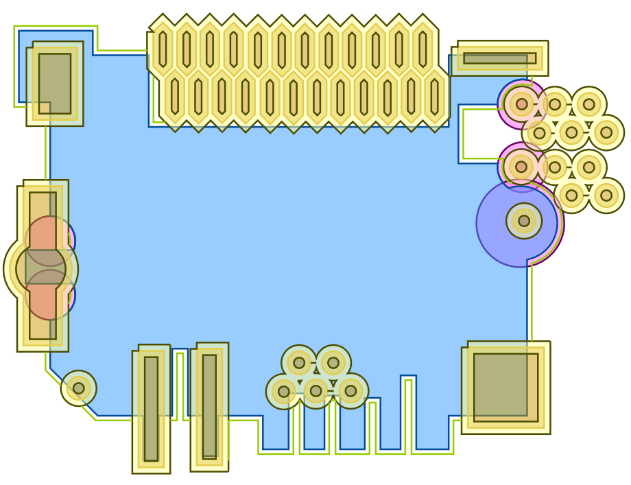

# CADContest 2022
[CADContest 2022](https://www.iccad-contest.org/2022/tw/index.html)
* Problem_E: Silkscreen Configuration Design Optimization
* Detailed Problem Description: [Silkscreen Configuration Design Optimization]([URL](https://drive.google.com/file/d/18LwJ1PI5LkwSsJOdPahuOyTnNix-u-HV/view))

### 問題介紹
程式需繪製其零件之絲印標示，且需要符合輸入提供零件外觀、銅箔範圍、絲印標示最短長度限制、絲印標示與零件外觀之限制
距離以及絲印標示與銅箔範圍之限制距離。

## Result
* 綠色: 絲印標示
* 藍色: 零件外觀
* 啡色: 銅箔範圍 + 絲印標示與銅箔範圍之最短限制距離
* 粉紅色: 絲印需要用弧線表示地方


> 生成檢查檔案會有ResultCheck.svg 
### Environment:
* Boost version: 1_73

如果有自訂安裝目錄:
```bash=
g++ -std=c++0x -o cade0021_final Source.cpp SCDOLibs/*.cpp SCDOLibs/ScoreCheck/*.cpp SCDOLibs/*.cpp SCDOLibs/SilkscreenOutput/*.cpp -I$BOOST_ROOT/include -L$BOOST_ROOT/lib -lboost_system
```
or
```bash=
g++ -std=c++0x -o cade0021_final Source.cpp SCDOLibs/*.cpp SCDOLibs/ScoreCheck/*.cpp SCDOLibs/*.cpp SCDOLibs/SilkscreenOutput/*.cpp
```

## 方法
1. 先把零件擴大之後，刪減去與已擴大銅箔重疊的地方。餘下的線就是合法的絲印標示
2. 通過三點共線分析那一些線段是直線與弧線
3. 保留合符最短限制距離的印標示
4. 檢查弧線絲印是否合法 -> 一直重複修改直到弧線絲印合法
5. 檢查是否需要另外增加絲印來符合 (題目要求: 絲印標示之座標極限值(xmax ymax xmin ymin)所構成之矩形範圍需覆蓋其零件外觀)
1. 絲印數量最佳化 (提高絲印標示與外觀相似度評分)

